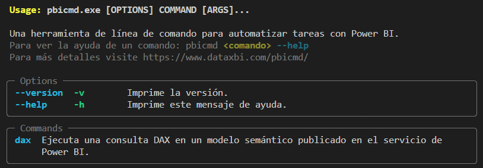

# pbicmd
### Una herramienta de línea de comando (CLI) para automatizar tareas de Power BI
---

La idea es ir incorporando comandos para automatizar diferentes tareas. Por ahora tiene un solo comando para ejecutar consultas DAX sobre un modelo semántico publicado en el servicio de Power BI.

`pbicmd` está hecho con Python y es de código abierto.

En este momento todo el código está en un solo fichero, para mantenerlo simple, pero la intención es ir separando los comandos en diferentes módulos.

También se distribuye como un ejecutable EXE de Windows para que se pueda utilizar sin tener que instalar Python.

## Primeros pasos

Para utilizar `pbicmd` no es necesario instalar nada, basta con descargar el fichero ZIP con la última versión desde:

https://github.com/dataxbi/pbicmd/releases

y expandirlo para obtener el ejecutable `pbicmd.exe` que es lo único que contiene el ZIP.

Luego abrimos una línea de comando en Windows, por ejemplo, con la aplicación Terminal, y nos cambiamos a la carpeta donde tengamos `pbicmd.exe`.

Si ejecutamos `pbicmd.exe` sin parámetros, obtenemos la ayuda con los comandos disponibles:

```
./pbicmd.exe 
```


Más adelante hay una sección con los comandos disponibles (un solo comando por ahora :) pero antes hablaremos de la autenticación.

## Autenticación

Para algunos comandos es necesario autenticarse con el servicio de Power BI y esto se puede hacer de varias maneras.

#### Autenticación interactiva
Esta autenticación se utiliza cuando ejecutamos `pbicmd` manualmente. Se abrirá el navegador por defecto con la página de autenticación de Microsoft donde debemos indicar nuestras credenciales de la misma manera que lo haríamos si entráramos al servicio de Power BI. Cuando la autenticación sea exitosa podemos regresar a la línea de comando donde veremos que `pbicmd` completa la ejecución del comando.

#### Autenticación con entidad de servicio
Esta autenticación se recomienda cuando `pbicmd` se va a ejecutar de manera automática. En lugar de utilizar un usuario y una contraseña hay que crear en Azure una entidad de servicio y luego dar acceso a dicha entidad de servicio a un área de trabajo de Power BI.

En esta página de la documentación de Microsoft se describe el proceso (para este caso interesa hasta el paso 4): https://learn.microsoft.com/es-es/power-bi/developer/embedded/embed-service-principal#step-1---create-a-microsoft-entra-app

Para autenticarse se emplean dos parámetros de dicha entidad de servicio: el ID de cliente y el secreto de cliente y además hay que indicar el tenant o dominio en Azure, que debe ser el mismo de Power BI.

Estos tres parámetros se deben asignar a las siguientes variables del entorno antes de ejecutar `pbicmd`:

- AZURE_CLIENT_ID
- AZURE_CLIENT_SECRET
- AZURE_TENANT_ID

Por ejemplo, en PowerShell se puede hacer así:
```
    $env:AZURE_CLIENT_ID = 'xxxxxxxx-xxxx-xxxx-xxxx-xxxxxxxxxxxx'
    $env:AZURE_CLIENT_SECRET = 'xxxxxxxxxxxxxxxxxxxxxxxxxxxxxxxxxxx'
    $env:AZURE_TENANT_ID = 'midominio.com'   
```

Si cuando se ejecuta `pbicmd` detecta estas variables del entorno, utilizará la entidad de servicio en lugar de la autenticación interactiva.

#### Otros métodos de autenticación
Para escenarios más avanzados se pueden utilizar otros métodos de autenticación.

`pbicmd` utiliza para la autenticación la librería [azure-identity](https://github.com/Azure/azure-sdk-for-python/tree/main/sdk/identity/azure-identity) y en específico la clase DefaultAzureCredential que es quien maneja los dos métodos de autenticación que hemos comentado anteriormente, pero también admite otros métodos, que se pueden consultar en la documentación de la librería: https://github.com/Azure/azure-sdk-for-python/tree/main/sdk/identity/azure-identity#defaultazurecredential


## Comandos

Para acceder a un comando se ejecuta `pbicmd` pasándole un parámetro con el nombre del comando y a continuación se pasan otros parámetros que requiera dicho comando.

Se puede imprimir la ayuda de un comando de la siguiente manera:
```
./pbicmd.exe <comando> --help
```
donde &lt;comando&gt; sería el nombre del comando.


### Comando `dax`

Este comando permite ejecutar una consulta DAX sobre un modelo semántico publicado en el servicio de Power BI y guardar el resultado en un fichero CSV o Parquet. Funciona con una licencia Pro.

Podemos imprimir la ayuda de este comando de la siguiente manera:
```
./pbicmd.exe dax --help
```

Para implementar este comando se utiliza la [API REST de Power BI](https://learn.microsoft.com/es-es/rest/api/power-bi/datasets/execute-queries) que tiene algunas limitaciones, entre las que se encuentran:
- Una consulta por llamada API.
- Una solicitud de tabla por consulta.
- Máximo de 100 000 filas o 1000 000 000 valores por consulta (lo que se alcance primero).
- Máximo de 15 MB de datos por consulta. Una vez superados los 15 MB, se completará la fila actual, pero no se escribirán filas adicionales.
- Hay un límite de 120 solicitudes de consulta por minuto por usuario, independientemente del conjunto de datos consultado.

Estas limitaciones no son un freno en muchos escenarios y como mencionamos antes, tiene la gran ventaja de que funciona con una licencia Pro.

La consulta DAX tiene que estar guardada en un fichero, que recomendamos que tenga la extensión .dax y que podríamos crear con la herramienta externa [DAX Studio](https://daxstudio.org/) o con la vista de consulta DAX de Power BI Desktop, si tenemos una versión de Noviembre 2023 o superior.

Dicha consulta tiene que comenzar con la instrucción EVALUATE y tiene que devolver una tabla.

Como mencionamos antes, el modelo semántico sobre el que se hará la consulta DAX tiene que estar publicado en un área de trabajo del servicio de Power BI. Y para utilizar este comando necesitamos el ID del modelo semántico, que se puede obtener abriendo dicho modelo en el servicio de Power BI y mirando en el URL que aparece en el navegador.

Por ejemplo, en el siguiente URL:
```
https://app.powerbi.com/groups/xxxxxxxx-xxxx-xxxx-xxxx-xxxxxxxxxxxx/datasets/dddddddd-dddd-dddd-dddd-dddddddddddd/details?experience=power-bi
```
EL ID de modelo semántico sería dddddddd-dddd-dddd-dddd-dddddddddddd

Suponiendo que tenemos nuestra consulta DAX guardada en el fichero `consulta.dax` y que el ID del modelo es `dddddddd-dddd-dddd-dddd-dddddddddddd` podemos ejecutar `pbicmd` de esta manera:
```
./pbicmd.exe dax consulta.dax -d dddddddd-dddd-dddd-dddd-dddddddddddd
```

Lo primero que pasará es que se abrirá una pestaña del navegador por defecto en la página de autenticación de Microsoft para que entremos las credenciales para acceder al área de trabajo donde está el modelo.

Luego se ejecutará la consulta y si todo fue bien, se guardará el resultado en el fichero `consulta-dddddddd-dddd-dddd-dddd-dddddddddddd.csv`. Por defecto el nombre del fichero de salida se forma concatenando el nombre del fichero donde está guardada la consulta DAX con el ID del modelo y se guardará en la carpeta actual.

Si queremos que el fichero de salida tenga otro nombre o esté en otra carpeta, podemos utilizar el parámetro opcional -o, por ejemplo:

```
./pbicmd.exe dax consulta.dax -d dddddddd-dddd-dddd-dddd-dddddddddddd -o c:/datos/resultado_consulta.csv
```

Podemos cambiar el formato del fichero de salida a Parquet utilizando el parámetro -f, por ejemplo:

```
./pbicmd.exe dax consulta.dax -d dddddddd-dddd-dddd-dddd-dddddddddddd -o c:/datos/resultado_consulta.parquet -f parquet
```
Y por último, podemos imprimir en la terminal el resultado de la consulta con el parámetro -p:
```
./pbicmd.exe dax consulta.dax -d dddddddd-dddd-dddd-dddd-dddddddddddd -p
```
Hay que tener en cuenta lo siguiente:
- Si la respuesta tiene más de 10 líneas, se imprimen las 5 primeras y las 5 últimas.
- Siempre se guarda el resultado completo en un fichero, que por defecto es CSV.
  