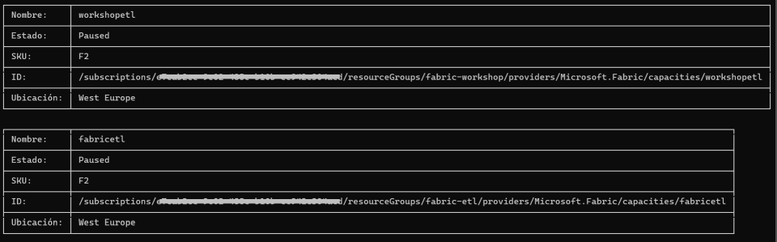

# pbicmd
### Una herramienta de línea de comando (CLI) para automatizar tareas de Power BI
---

La idea es ir incorporando comandos para automatizar diferentes tareas. 

Por ahora tiene estos comandos:

- [comando `dax`](#comando-dax)
- [comando `daxdif`](#comando-daxdif)
- [comando `fabric`](#comando-fabric)
- [comando `toparquet`](#comando-toparquet)
- [comando `todelta`](#comando-todelta)

`pbicmd` está hecho con Python y es de código abierto.

También se distribuye como un ejecutable EXE de Windows para que se pueda utilizar sin tener que instalar Python.

## Primeros pasos

Para utilizar `pbicmd` no es necesario instalar nada, basta con descargar el fichero ZIP con la última versión desde:

https://github.com/dataxbi/pbicmd/releases

y expandirlo para obtener el ejecutable `pbicmd.exe` que es lo único que contiene el ZIP.

Luego abrimos una línea de comando en Windows, por ejemplo, con la aplicación Terminal, y nos cambiamos a la carpeta donde tengamos `pbicmd.exe`.

Si ejecutamos `pbicmd.exe` sin parámetros, obtenemos la ayuda con los comandos disponibles:

```
./pbicmd.exe 
```


## Comandos

Para acceder a un comando se ejecuta `pbicmd` pasándole un parámetro con el nombre del comando y a continuación se pasan otros parámetros que requiera dicho comando.

Se puede imprimir la ayuda de un comando de la siguiente manera:
```
./pbicmd.exe <comando> --help
```
donde &lt;comando&gt; sería el nombre del comando.


### Comando `dax`

Este comando permite ejecutar una consulta DAX sobre un modelo semántico publicado en el servicio de Power BI y guardar el resultado en un fichero CSV o Parquet. Funciona con una licencia Pro.

Podemos imprimir la ayuda de este comando de la siguiente manera:
```
./pbicmd.exe dax --help
```

Este comando necesita autenticación en el servicio de Power BI, por lo que te invito a leer más abajo las [opciones de autenticación disponibles](#autenticación).

Si lo ejecutas manualmente se abrirá el navegador por defecto con la página de autenticación de Microsoft.

Para implementar este comando se utiliza la [API REST de Power BI](https://learn.microsoft.com/es-es/rest/api/power-bi/datasets/execute-queries) que tiene algunas limitaciones, entre las que se encuentran:
- Una consulta por llamada API.
- Una solicitud de tabla por consulta.
- Máximo de 100 000 filas o 1000 000 000 valores por consulta (lo que se alcance primero).
- Máximo de 15 MB de datos por consulta. Una vez superados los 15 MB, se completará la fila actual, pero no se escribirán filas adicionales.
- Hay un límite de 120 solicitudes de consulta por minuto por usuario, independientemente del conjunto de datos consultado.

Estas limitaciones no son un freno en muchos escenarios y como mencionamos antes, tiene la gran ventaja de que funciona con una licencia Pro.


La consulta DAX tiene que estar guardada en un fichero, que recomendamos que tenga la extensión .dax y que podríamos crear con la herramienta externa [DAX Studio](https://daxstudio.org/) o con la vista de consulta DAX de Power BI Desktop, si tenemos una versión de Noviembre 2023 o superior.

Dicha consulta tiene que comenzar con la instrucción EVALUATE y tiene que devolver una tabla.

Como mencionamos antes, el modelo semántico sobre el que se hará la consulta DAX tiene que estar publicado en un área de trabajo del servicio de Power BI. Y para utilizar este comando necesitamos el ID del modelo semántico, que se puede obtener abriendo dicho modelo en el servicio de Power BI y mirando en el URL que aparece en el navegador.

Por ejemplo, en el siguiente URL:
```
https://app.powerbi.com/groups/xxxxxxxx-xxxx-xxxx-xxxx-xxxxxxxxxxxx/datasets/dddddddd-dddd-dddd-dddd-dddddddddddd/details?experience=power-bi
```
EL ID de modelo semántico sería dddddddd-dddd-dddd-dddd-dddddddddddd

Suponiendo que tenemos nuestra consulta DAX guardada en el fichero `consulta.dax` y que el ID del modelo es `dddddddd-dddd-dddd-dddd-dddddddddddd` podemos ejecutar `pbicmd` de esta manera:
```
./pbicmd.exe dax consulta.dax -d dddddddd-dddd-dddd-dddd-dddddddddddd
```

Lo primero que pasará es que se abrirá una pestaña del navegador por defecto en la página de autenticación de Microsoft para que entremos las credenciales para acceder al área de trabajo donde está el modelo.

Luego se ejecutará la consulta y si todo fue bien, se guardará el resultado en el fichero `consulta-dddddddd-dddd-dddd-dddd-dddddddddddd.csv`. Por defecto el nombre del fichero de salida se forma concatenando el nombre del fichero donde está guardada la consulta DAX con el ID del modelo y se guardará en la carpeta actual.

Si queremos que el fichero de salida tenga otro nombre o esté en otra carpeta, podemos utilizar el parámetro opcional -o, por ejemplo:

```
./pbicmd.exe dax consulta.dax -d dddddddd-dddd-dddd-dddd-dddddddddddd -o c:/datos/resultado_consulta.csv
```

Podemos cambiar el formato del fichero de salida a Parquet utilizando el parámetro -f, por ejemplo:

```
./pbicmd.exe dax consulta.dax -d dddddddd-dddd-dddd-dddd-dddddddddddd -o c:/datos/resultado_consulta.parquet -f parquet
```
Y por último, podemos imprimir en la terminal el resultado de la consulta con el parámetro -p:
```
./pbicmd.exe dax consulta.dax -d dddddddd-dddd-dddd-dddd-dddddddddddd -p
```
Hay que tener en cuenta lo siguiente:
- Si la respuesta tiene más de 10 líneas, se imprimen las 5 primeras y las 5 últimas.
- Siempre se guarda el resultado completo en un fichero, que por defecto es CSV.


### Comando `daxdif` 

Este comando compara la ejecución de una misma consulta DAX sobre dos modelos semánticos publicados en el servicio de Power BI y guarda las diferencias en un archivo CSV.

Para hacer la comparación, redondea a 4 lugares decimales y utiliza un valor de tolerancia de 0.01. Tanto el redondeo como la tolerancia se pueden cambiar utilizando parámetros.

Podemos imprimir la ayuda de este comando de la siguiente manera:
```
./pbicmd.exe daxdif --help
```

Este comando necesita autenticación en el servicio de Power BI, por lo que te invito a leer más abajo las [opciones de autenticación disponibles](#autenticación).

Si lo ejecutas manualmente se abrirá el navegador por defecto con la página de autenticación de Microsoft.

Para implementar este comando, se utiliza la API REST de Power BI, la cual tiene algunas limitaciones, como se menciona en la descripción del comando `dax`.

La consulta DAX tiene que estar guardada en un fichero, que recomendamos que tenga la extensión .dax, y 
tiene que comenzar con la instrucción EVALUATE y devolver una tabla.

Los modelos semánticos sobre los que se hará la consulta DAX tienen que estar publicados en el servicio de Power BI. Y para utilizar este comando, necesitamos el ID de ambos modelos semánticos, que se puede obtener abriendo cada modelo en el servicio de Power BI y mirando en el URL que aparece en el navegador. Para más detalles, puede revisar la descripción del comando `dax`.

Una vez obtenidos los ID de los dos modelos semánticos, se pasan a `pbicmd` en los parámetros -d1 y -d2.

Por ejemplo, si tenemos nuestra consulta DAX guardada en el fichero `consulta.dax`, el ID del primer modelo es `dddddddd-dddd-dddd-dddd-dddddddddddd` y el ID del segundo modelo es `eeeeeeee-eeee-eeee-eeee-eeeeeeeeeeee`, podemos ejecutar `pbicmd` de esta manera:
```
./pbicmd.exe dax consulta.dax -d1 dddddddd-dddd-dddd-dddd-dddddddddddd -d2 eeeeeeee-eeee-eeee-eeee-eeeeeeeeeeee
```

Lo primero que pasará es que se abrirá una pestaña del navegador por defecto en la página de autenticación de Microsoft para que entremos las credenciales para acceder al área de trabajo donde está el modelo.

Luego, se ejecutará la consulta en ambos modelos y se compararán los resultados. Si no se detecta ninguna diferencia, se indica con un texto en color verde. Si se encuentra alguna diferencia, se indica con un texto en color rojo y se guarda el resultado de la comparación en el archivo `consulta_dif_dddddddd-dddd-dddd-dddd-dddddddddddd_eeeeeeee-eeee-eeee-eeee-eeeeeeeeeeee.csv`. 

Por defecto, el nombre de este archivo se forma concatenando el nombre del fichero donde está guardada la consulta DAX con los ID de ambos modelos y se guarda en la carpeta actual, pero se puede indicar cualquier nombre utilizando el parámetro `-od`.

Este archivo CSV contendrá las columnas de la consulta DAX y dos columnas adicionales:
- La columna `__origen__` contendrá los valores `d1` o `d2` para identificar si la fila proviene del primer o el segundo modelo semántico.
- La columna `__diferencia__` permitirá identificar las columnas de la fila que fueron diferentes en la comparación.

Si además de guardar las diferencias en un fichero CSV, se quiere imprimir en la consola, se puede usar el comando `--print`. Hay que tener en cuenta que si hay más de 10 filas con diferencias, solo se imprimirán las 5 primeras y las 5 últimas.

Los resultados de ejecutar la consulta DAX en cada modelo también se guardan en archivos CSV con un nombre que se forma concatenando el nombre del archivo con la consulta DAX y el ID del modelo, pero dichos nombres también se pueden cambiar con los parámetros `-o1` y `-o2`.

#### Columnas claves

Para que la comparación sea efectiva, la tabla resultante de la consulta DAX tiene que tener una o varias columnas que en conjunto sean únicas para cada fila, que llamaremos columnas claves, y el resto de las columnas serán las que se utilicen para hacer la comparación.

Por defecto, `pbicmd` asume que las columnas claves son todas las columnas con texto, pero se pueden incluir más columnas con el parámetro `-ki`. Por ejemplo, si la consulta DAX devuelve una tabla donde las columnas claves son `Producto[Categoria]`, `Cliente[Provincia]` y `Calendario[Año]`, esta última columna podría no

 ser identificada como de texto por lo que habría que indicarlo, como se muestra a continuación:

```
./pbicmd.exe dax consulta.dax -d1 dddddddd-dddd-dddd-dddd-dddddddddddd -d2 eeeeeeee-eeee-eeee-eeee-eeeeeeeeeeee -ki Calendario[Año]
```

Si hubiera que incluir más columnas, se pasarían más parámetros `-ki` con los otros nombres de columnas.

#### Redondeo y tolerancia

Cuando se comparan números decimales puede que haya pequeñas diferencias que no signifiquen que el resultado es incorrecto. Por esa razón, antes de hacer la comparación, los valores decimales se redondean y, cuando se hace la comparación, se tiene en cuenta un valor de tolerancia. 

Por defecto, se redondea a 4 lugares decimales, y se puede cambiar con el parámetro `-dp`.
La tolerancia por defecto es 0.01, y se puede cambiar con el parámetro `-to`.

### Comando `fabric`

Este comando permite manejar las capacidades de Microsoft Fabric mediante varios subcomandos.

Puedes imprimir la ayuda de este comando de la siguiente manera:
```
./pbicmd.exe fabric --help
```

Para utilizar los subcomandos necesitas un usuario o una entidad de servicio con acceso a Azure y con el permiso de colaborador en las capacidades Fabric que quieras manejar.

Te invito a leer más abajo las [opciones de autenticación disponibles](#autenticación).

Si lo ejecutas manualmente se abrirá el navegador por defecto con la página de autenticación de Microsoft.


#### Subcomando `capacities`

Con este subcomando del comando `fabric` puedes obtener un listado de las capacidades Fabric a las que tengas acceso en una subscripción de Azure.

Puedes imprimir la ayuda de este subcomando de la siguiente manera:
```
./pbicmd.exe fabric capacities --help
```
Solo requiere el parámetro `-as` para indicar el ID de la subscripción a Azure. 

Por ejemplo:
```
./pbicmd.exe fabric capacities -as dddddddd-dddd-dddd-dddd-dddddddddddd
```

Lo que devolverá un listado como el de la imagen siguiente:



donde se ven dos capacidades F2 que están en pausa. El valor del ID, que es una cadena de texto larga, se utiliza en el resto de los subcamandos para pausar, reanudar o cambiar el SKU de una capacidad.

#### Subcomando `resume`

Con este subcomando del comando `fabric` puedes reanudar una capacidad que esté en pausa.

Puedes imprimir la ayuda de la siguiente manera:
```
./pbicmd.exe fabric resume --help
```

Tiene el parámetro requerido `-c` para indicar el ID de la capacidad, que es la cadena de texto larga devuelta por el subcomando `capacities`.

También tiene un parámetro opcional `-k` para indicar un SKU al que se debe cambiar la capacidad antes de reanudarla, y que admite los valores `F2`, `F4`, y así hasta `F2048`.

La capacidad puede demorar unos segundos en cambiar de estado, por lo que al ejecutar este subcomando se dará la orden de reanudar la capacidad y se esperarán 15 segundos y entonces se consultará el estado de la capacidad imprimiendo los detalles para que puedas comprobar visualmente si cambió el estado, en caso de que estés ejecutandolo manualmente.

#### Subcomando `suspend`

Con este subcomando del comando `fabric` puedes pausar una capacidad que esté en funcionamiento. 

Puedes imprimir la ayuda de la siguiente manera:
```
./pbicmd.exe fabric suspend --help
```

Solo tiene el parámetro requerido `-c` para indicar el ID de la capacidad, que es la cadena de texto larga devuelta por el subcomando `capacities`.

La capacidad puede demorar unos segundos en cambiar de estado, por lo que al ejecutar este subcomando se dará la orden de reanudar la capacidad y se esperarán 15 segundos y entonces se consultará el estado de la capacidad imprimiendo los detalles para que puedas comprobar visualmente si cambió el estado, en caso de que estés ejecutandolo manualmente.

#### Subcomando `sku`

Con este subcomando puedes cambiar el SKU a una capacidad.

Puedes imprimir la ayuda de esta manera:
```
./pbicmd.exe fabric sku --help
```

Solo tiene el parámetro requerido `-k` para indicar el SKU y que admite los valores `F2`, `F4`, y así hasta `F2048`.


### Comando `toparquet`

Este comando convierte archivos CSV o JSON a Parquet. Puede convertir un solo archivo o todos los archivos de una carpeta que cumplan con un patrón.

Podemos imprimir la ayuda de este comando de la siguiente manera:
```
./pbicmd.exe toparquet --help
```

El único parámetro requerido es la ruta al origen que puede ser un archivo CSV o JSON o una carpeta con archivos CSV o JSON.

Por ejemplo, si ejecutamos:
```
./pbicmd.exe toparquet c:\taxis\yellow_tripdata_2021-01.csv
```

Se creará el archivo `c:\taxis\yellow_tripdata_2021-01.parquet` en la misma carpeta del archivo original.

Para crear el archivo Parquet en otra carpeta, hay que utilizar el parámetro `-o`, por ejemplo:

```
./pbicmd.exe toparquet c:\taxis\yellow_tripdata_2021-01.csv -o c:\taxis\parquet
```

Y se creará el archivo `yellow_tripdata_2021-01.parquet` en la carpeta `c:\taxis\parquet`.

La carpeta tiene que existir.

El parámetro `-o` también puede ser una ruta a un archivo si se quiere que el nombre del archivo Parquet sea diferente que el nombre del archivo CSV o JSON.

```
./pbicmd.exe toparquet c:\taxis\yellow_tripdata_2021-01.csv -o c:\taxis\parquet\trips_2021-01.parquet
```

El origen también puede ser la ruta a una carpeta y en ese caso se convertirán a Parquet todos los archivos de la carpeta.

```
./pbicmd.exe toparquet c:\taxis
```

Los archivos Parquet resultantes se crearán en la misma carpeta y con el mismo nombre del archivo original pero cambiando la extensión a .parquet.

Se puede utilizar el parámetro `-o` para crear los archivos Parquet en otra carpeta.

```
./pbicmd.exe toparquet c:\taxis -o c:\taxis\parquet
```

En este caso en que el origen es una carpeta, sólo se procesan los archivos con la extensión `*.csv`.

Es posible cambiar este patrón de búsqueda utilizando el parámetro `-p`. 

Por ejemplo:

```
./pbicmd.exe toparquet c:\taxis -p yellow_tripdata_*.csv
```

El delimitador de los archivos CSV se detecta de manera automática leyendo una muestra de cada archivo de origen. Si por alguna razón no se pudiera detectar, recibirá un mensaje de error y deberá indicar el delimitador utilizando el parámetro `-d`. 

Por ejemplo:

```
./pbicmd.exe toparquet c:\taxis -d ";"
```

El formato por defecto de los archivos de origen es CSV, pero se puede cambiar a JSON con el parámetro `-f`:

```
./pbicmd.exe toparquet c:datos\json -f json

```

En este caso el patrón por defecto para los archivos de origen será `*.json`


### Comando `todelta`

Este comando convierte archivos CSV a una tabla Delta (https://delta.io/). Puede convertir un solo archivo o todos los archivos de una carpeta que cumplan con un patrón.

Podemos imprimir la ayuda de este comando de la siguiente manera:
```
./pbicmd.exe todelta --help
```

Requiere dos parámetros: 
- la ruta al origen, que puede ser un archivo CSV o una carpeta con archivos CSV
- la ruta a la carpeta donde se va a guardar la tabla Delta

Por ejemplo, si ejecutamos:
```
./pbicmd.exe todelta c:\taxis\yellow_tripdata_2021-01.csv c:\taxis_delta
```

Se creará la carpeta `c:\taxis_delta` que contendrá los datos del CSV pero en formato Delta.


El origen también puede ser la ruta a una carpeta y en ese caso se convertirán a Delta todos los archivos de la carpeta con extensión `csv`.

```
./pbicmd.exe todelta c:\taxis c:\taxis_delta
```

Es posible indicar un patrón para filtrar los archivos de la carpeta, utilizando el parámetro `-p`. 

Por ejemplo:

```
./pbicmd.exe todelta c:\taxis c:\taxis_delta -p yellow_tripdata_*.csv
```

El delimitador de los archivos CSV se detecta de manera automática leyendo una muestra de cada archivo de origen. Si por alguna razón no se pudiera detectar, recibirá un mensaje de error y deberá indicar el delimitador utilizando el parámetro `-d`. 

Por ejemplo:

```
./pbicmd.exe todelta c:\taxis c:\taxis_delta -d ";"
```

El formato por defecto de los archivos de origen es CSV, pero se puede cambiar a JSON con el parámetro `-f`:

```
./pbicmd.exe todelta c:datos\json c:\datos\json_delta -f json

```

En este caso el patrón por defecto para los archivos de origen será `*.json`


Si la carpeta de destino de la tabla Delta no existe, se creará. 

Si la carpeta de destino existe, y ya contiene una tabla Delta, tendrá que utilizar el parámetro `-dm` para indicar si quiere sobrescribir los datos o si los quiere anexar.

Ejemplo de sobrescribir: 

```
./pbicmd.exe todelta c:\taxis c:\taxis_delta -md overwrite
```

Ejemplo de anexar:

```
./pbicmd.exe todelta c:\taxis c:\taxis_delta -md append
```

Utilizando el parámetro `-fnc` es posible añadir una columna a la tabla Delta que contenga el nombre de cada archivo de origen, sin la extensión:

```
./pbicmd.exe todelta c:\taxis c:\taxis_delta -fnc nombre_archivo
```


## Autenticación

Para algunos comandos es necesario autenticarse con el servicio de Power BI y esto se puede hacer de varias maneras.

#### Autenticación interactiva
Esta autenticación se utiliza cuando ejecutamos `pbicmd` manualmente. Se abrirá el navegador por defecto con la página de autenticación de Microsoft donde debemos indicar nuestras credenciales de la misma manera que lo haríamos si entráramos al servicio de Power BI. Cuando la autenticación sea exitosa podemos regresar a la línea de comando donde veremos que `pbicmd` completa la ejecución del comando.

#### Autenticación con entidad de servicio
Esta autenticación se recomienda cuando `pbicmd` se va a ejecutar de manera automática. En lugar de utilizar un usuario y una contraseña hay que crear en Azure una entidad de servicio y luego dar acceso a dicha entidad de servicio a un área de trabajo de Power BI.

En esta página de la documentación de Microsoft se describe el proceso (para este caso interesa hasta el paso 4): https://learn.microsoft.com/es-es/power-bi/developer/embedded/embed-service-principal#step-1---create-a-microsoft-entra-app

Para autenticarse se emplean dos parámetros de dicha entidad de servicio: el ID de cliente y el secreto de cliente y además hay que indicar el tenant o dominio en Azure, que debe ser el mismo de Power BI.

Estos tres parámetros se deben asignar a las siguientes variables del entorno antes de ejecutar `pbicmd`:

- AZURE_CLIENT_ID
- AZURE_CLIENT_SECRET
- AZURE_TENANT_ID

Por ejemplo, en PowerShell se puede hacer así:
```
    $env:AZURE_CLIENT_ID = 'xxxxxxxx-xxxx-xxxx-xxxx-xxxxxxxxxxxx'
    $env:AZURE_CLIENT_SECRET = 'xxxxxxxxxxxxxxxxxxxxxxxxxxxxxxxxxxx'
    $env:AZURE_TENANT_ID = 'midominio.com'   
```

Si cuando se ejecuta `pbicmd` detecta estas variables del entorno, utilizará la entidad de servicio en lugar de la autenticación interactiva.

#### Otros métodos de autenticación
Para escenarios más avanzados se pueden utilizar otros métodos de autenticación.

`pbicmd` utiliza para la autenticación la librería [azure-identity](https://github.com/Azure/azure-sdk-for-python/tree/main/sdk/identity/azure-identity) y en específico la clase DefaultAzureCredential que es quien maneja los dos métodos de autenticación que hemos comentado anteriormente, pero también admite otros métodos, que se pueden consultar en la documentación de la librería: https://github.com/Azure/azure-sdk-for-python/tree/main/sdk/identity/azure-identity#defaultazurecredential
